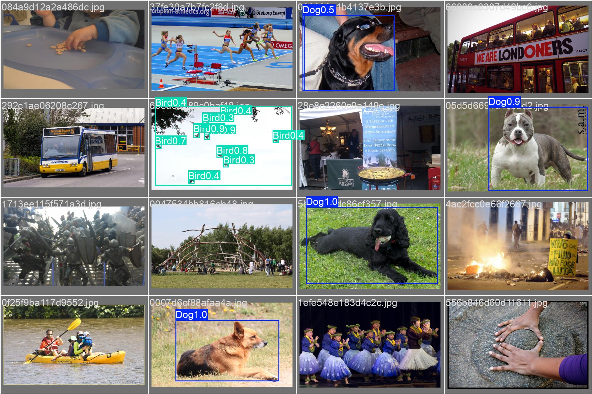
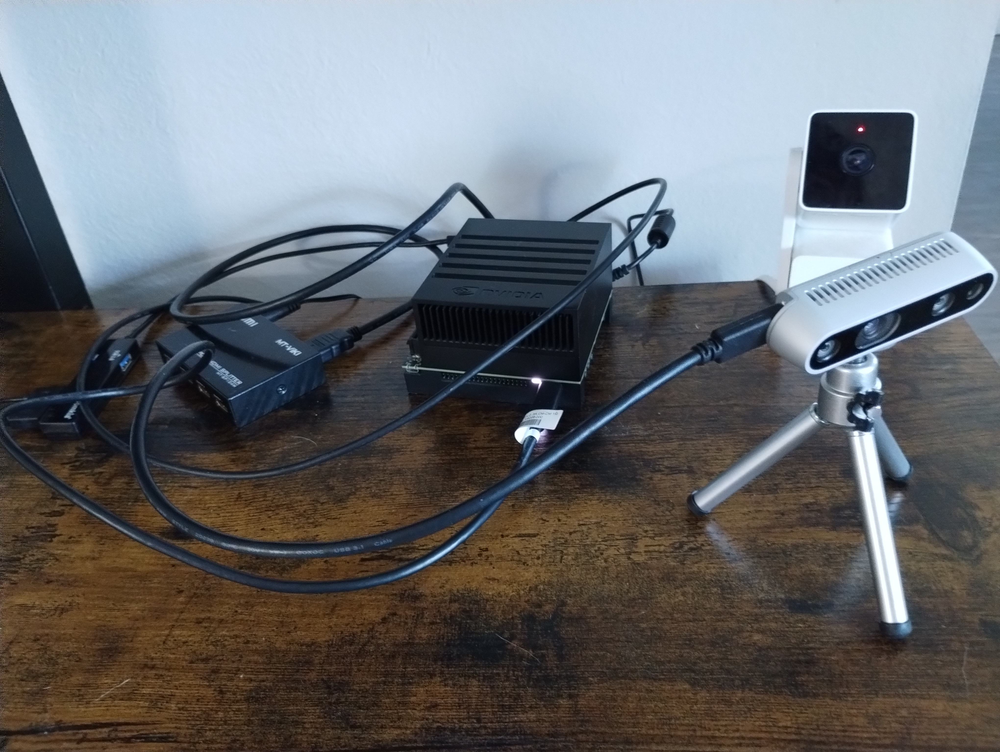
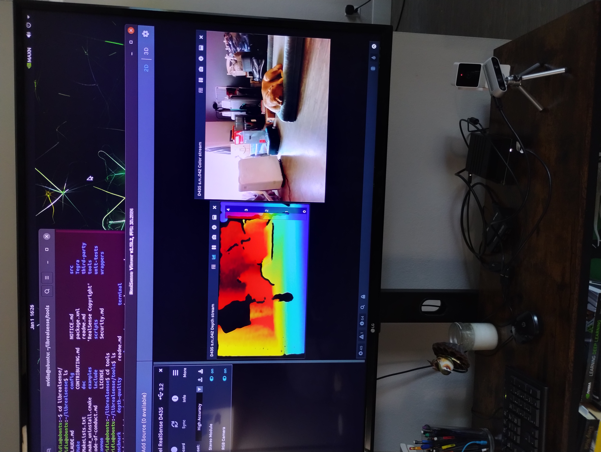

# Tiger Watch
# Cascaded Edge-AI Wildlife & Pet Identification Pipeline

Objective: A two-stage computer vision pipeline designed to detect birds, pets, snakes, bears and tigers.
Application: outdoor camera application for homes located close to wildlife.

This supervised Machine Learning project bridges the gap between training model on desktop GPU (NVIDIA RTX 4060ti) 
and resource-constrained edge deployment (**NVIDIA Jetson AGX Xavier**) using **TensorRT** optimization.

Computer Vision Task: object detection and classification of animals visible on porch camera connected to edge device (Jetson AGX)

 

 
Classes used in training model: "Dog", "Cat", "Tiger", "Bird", "Snake", "Bear".

Success metric: detect class objects and correctly identify each with proper box and class description.

Hardware | training: AMD Ryzen 7, NVIDIA RTX 4060ti
  
Hardware | deployment: NVIDIA Jetson AGX Xavier 16, Intel RealSense Depth Camera D435        

                  
Jetson SDK: JetPack 5.1.6 | [https://developer.nvidia.com/embedded/jetpack-sdk-516] | only available for host Ubuntu version 20.04 or less (I installed 20.04 alongside my 24.04)

RealSense SDK: [https://github.com/realsenseai/librealsense/blob/master/doc/installation_jetson.md]

Dataset source : Open Images Dataset v7 from Google | [https://storage.googleapis.com/openimages/web/download_v7.html]  
Dataset management: Voxel51 | [https://docs.voxel51.com/index.html#]

Benchmark reference: 
[https://github.com/NVIDIA-AI-IOT/jetson_benchmarks/tree/master] | [https://github.com/mlcommons/inference_results_v3.1/tree/main/closed/NVIDIA]

- Setup SW on host PC with RTX GPU | Host.md

- Provision Jetson | Jetson.md 

- Provision Jetson with ultralytics pre-configured image | Jetson_Docker.md 
  Using docker also requires external SSD storage and docker configurations for it.  

- Dataset prep: download and prepare dataset using FiftyOne | Dataset_prep.md

- Training Computer Vision model | Train_model.md

- Export YOLO custom model to ONNX format for deployment on Jetson | Convert_yolo_to_ONNX.md

